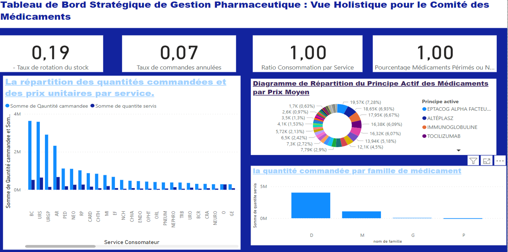

# 🏥 Hospital Pharmaceutical Management Dashboard

## 📋 Project Overview
Strategic dashboard developed for CHU Mohammed VI Oujda's pharmacy 
department to optimize medication management and decision-making.

## 🎯 Objectives
- Monitor medication consumption by service
- Track costs and budget management
- Manage stock rotation and expiration dates
- Provide KPIs for the Medications Committee
- Enable what-if analysis for strategic planning

## 🛠️ Technologies
- **Power BI** - Data visualization and dashboards
- **Power Query** - Data preprocessing and ETL
- **DAX** - Advanced calculations

## 📊 Dashboard Features

### Strategic Overview

- Stock rotation rate monitoring
- Order cancellation tracking
- Service consumption analysis
- Active ingredient distribution

### Service Monitoring

- Cost distribution by service
- Quantity ordered per service
- Expiration date tracking
- Order cancellation rate by service

## 🔒 Confidentiality Note
Data and specific values have been anonymized to respect 
hospital confidentiality requirements.

## 📅 Timeline
November - December 2023

## 👥 Context
Academic project in partnership with CHU Mohammed VI Oujda
